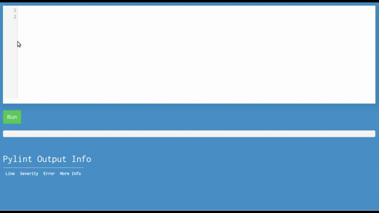
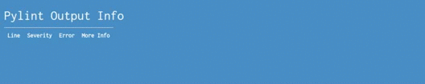

# PythonBuddy 🖊️ 🐍 
[](https://travis-ci.org/ethanchewy/OnlinePythonLinterSyntaxChecker)
<br>
Online Python 2.7 Programming with Live Pylint Syntax Checking!
<br>

<br>

###Usage
1) Fetch from repo:
  ```
  git clone https://github.com/ethanchewy/PythonBuddy.git
  ```
2) Change to directory 
  ```
  cd OnlinePythonLinterSyntaxChecker
  ```
2) Create virtualenv based on your own system:
  ```
  virtualenv -p /usr/bin/python2.7 venv
  ```
3) Activate vitrual environment:
  ```
  source venv/bin/activate
  ```
4) Pipe requirements to venv folder:
  ```
  pip install -r requirements.txt
  ```
5) Set FLASK_APP variable:
  ```
  export FLASK_APP = app.py
  ```
6) Run flask app:
  ```
  flask run
  ```
  Open your browser to [localhost:5000](http://localhost:5000) . Voila! 🎉
###Current Features:
Live Syntax Checking
<br>
<li>Live Syntax Checking
  <ul>
    <li>Uses Pylint as checker (only prints out errors and warnings)</li>
    <li>Syntax Highlighting</li>
  </ul>
</li>

<br>
<li>>Python 2.7 Execution
  <ul>
    <li>Python 2.7 Complilation</li>
    <li>Basic Sandboxing</li>
  </ul>
</li>

<br>
<li>Live Error Table with Additional Help Suggestions</li>

<br>

###Customizing Options

1. Edit app.py to change any pylint options (like showing/hiding hints warnings)
2. Want Python 3? 
 1. Change step 2 from the installation instructions to: 
    ```
    virtualenv --python=/usr/bin/python3.2 venv
    ```
 2. Follow rest of instructions
<br>

###Future Goals:
- Make easily embeddable for MOOCs like edX and other education platform
- Stricter Python Sandboxing via Pypy's sandboxing solution
- Lower CPU usage
- Allow users to generate a link to a unique code snippet similar to JSBin

###FAQ:
Why did you make this? <br>
I made this so that MOOCs like edX or codecademy could easily embed and use this on their courses so students wouldn't have to go through the frustrations of setting up a Python environment and jump right into Python programming. Also, professors and teachers could easily set up a server and allow students to quickly test out their code with PythonBuddy online.

Has anyone created anything like this before? <br>
There has never been a live syntax checker for python online. Similar projects that are not "live" are http://pep8online.com/ and http://antares.sip.ucm.es/cesar/pylint/

Has can I contribute? <br>
You can 🌟 star my repo, fork my repo, submit a pull request, and/or open issues!

Where's the code for embedding it in MOOCs? <br>
I'm currently working on this over here (for edx specifically): https://github.com/ethanchewy/pybuddy2.0

I want the code to actually compile and run in a certain way?
If you want to actually execute the python safely look at my XBlock code: https://github.com/ethanchewy/pybuddy2.0 . Remember to sandbox the code with RestrictedPython or something.

How do I run my own server?
https://github.com/ethanchewy/OnlinePythonLinterSyntaxChecker/wiki

###Credits:
This was made by Ethan Chiu as a research project under the guidance of Wellesley College professor Eni Mustafaraj.
