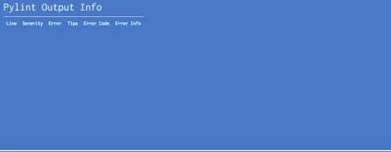

# <a href="http://pythonbuddy.com">PythonBuddy</a> 🖊️ 🐍
[](https://travis-ci.org/ethanchewy/OnlinePythonLinterSyntaxChecker)
[](http://paypal.me/Ethan302)
<br>
Online Python 3.6 Programming with Live Pylint Syntax Checking!
<br>


### Usage
1) Fetch from repo:
  ```
  git clone https://github.com/ethanchewy/PythonBuddy.git
  ```
2) Change to PythonBuddy directory
  ```
  cd PythonBuddy
  ```
2) Create virtualenv based on your own system:
  ```
  python3 -m venv venv
  ```
3) Activate virtual environment:
  ```
  source venv/bin/activate
  ```
4) Enusre that your virtualenv uses Python 3.6.9 via this command:
  ```
  python --version
  ```
  If you don't use Python 3.6.9, some Python libraries that PythonBuddy relies on may not work. Please refer to this documentation for figuring out how to create a specific version of Python via vitualenv via this StackOverflow [post](https://stackoverflow.com/a/39713544).
  
5) Pipe requirements to venv folder:
  ```
  pip install -r requirements.txt
  ```
6) Change to the PythonBuddy application folder. You should now be in `PythonBuddy/PythonBuddy/`.
  ```
  cd PythonBuddy
  ```
7) Set FLASK_APP variable:
  ```
  export FLASK_APP=app.py
  ```
8) Run flask app:
  ```
  flask run
  ```
  Open your browser to [localhost:5000](http://localhost:5000) . Voila! 🎉
### Current Features:
<br>
<li>Live Syntax Checking
  <ul>
    <li>Uses Pylint as checker (only prints out errors and warnings)</li>
    <li>Syntax Highlighting</li>
  </ul>
</li>


<br>
<li>Python Execution
  <ul>
    <li>Python Complilation</li>
    <li>Basic Sandboxing</li>
  </ul>
</li>


<br>
<li>Live Error Table with Additional Help Suggestions</li>



<br>

### Secure (Sandboxed) Version using Docker
Please check out [PythonBuddySandboxed](https://github.com/ethanchewy/PythonBuddySandboxed) for a fully working web implementation which uses a dockerized version of PythonBuddy called [PythonBuddySandbox](https://github.com/christophetd/docker-python-sandbox).

This builds off of christophetd's [docker-python-sandbox](https://github.com/christophetd/docker-python-sandbox) and just modifies it so that it runs pylint in the background and processes the pylint messages on the client side.

To see how he implements it on the web side, please check out [https://github.com/christophetd/code-execution-api-demo](https://github.com/christophetd/code-execution-api-demo)

This is still in alpha stage so there might be some bugs. If you want to implement this please check the 4 links above since documentation is a WIP.


### Customization Options

1. Edit app.py to change any pylint options (like showing/hiding hints warnings)
2. Security
 1. To create a much more secure Python Environment, consider using my Docker + Node.js implementation: https://github.com/ethanchewy/PythonBuddy#secure-sandboxed-version-using-docker
3. For versions that used Python 2 or to see older versions, check: https://github.com/ethanchewy/PythonBuddy/releases

### Unit Tests
To run tests, run this at the root directory:
```
pytest
```
For coverage run the following command in the root directory:
```
pytest --cov-report html --cov=PythonBuddy tests/
```


### Future Goals:
- Make easily embeddable for MOOCs like edX and other education platform
- Create an analytics system that models the student's python learning and tells them where they need improvement (many programming students learn by copying and pasting and don't actually understand the nuances of the Python language).
- Stricter Python Sandboxing via Pypy's sandboxing solution
- Lower CPU usage
- Allow users to generate a link to a unique code snippet similar to JSBin
- Unit tests for client side JS

### FAQ:
Why did you make this? <br>
In 2014, I was a Community TA at MIT edX 6.00.1x course where I helped teach over 1000 students. The year after I started researching under Prof. Eni Mustafaraj. She had a data set from that course and we saw a high attrition rate of students within the first 2 weeks. After digging through the curriculumn and data, I realized that the students left because of difficulties setting up their Python environment and complex error messages that they couldn't solve when running their code (ex: some students had path issues).  
<br>
So, I created PythonBuddy to address this issue so that students wouldn't have to go through the frustrations of setting up a Python environment and running into seemingly "random" bugs. PythonBuddy allows users to jump right into Python programming with the support of live syntax checking & highlighting. Also, professors and teachers could easily set up a server and allow students to quickly test out their code with PythonBuddy online.

Has anyone created anything like this before? <br>
There has never been a live syntax checker for python online. Similar projects that are not "live" are http://pep8online.com/ and http://antares.sip.ucm.es/cesar/pylint/

How can I contribute? <br>
You can 🌟 star my repo, fork my repo, submit a pull request, and/or open issues!

Where's the code for embedding it in MOOCs? <br>
I'm currently working on this over here (for edx specifically): https://github.com/ethanchewy/pybuddy2.0 . If you want to embed this project directly to your site, you would use an iframe:
```
<iframe src="https://pythonbuddy.com"></iframe>
```

I want the code to actually compile and run in a certain way?<br>
To run PythonBuddy securely, you can check out my implementation of PythonBuddy with Docker and Node.js: https://github.com/ethanchewy/PythonBuddy#secure-sandboxed-version-using-docker. Basically, it dockerizes each user session (similar to creating a virtual machine for each user) and destroys it if it uses too much memory or runs malicious code.
<br>
If you want to actually execute the python in a restricted fashion at my Restricted Python branch: https://github.com/ethanchewy/PythonBuddy/tree/restrictedpython.

How do I run my own server?
Regular: https://github.com/ethanchewy/OnlinePythonLinterSyntaxChecker/wiki
<br>
Sandboxed: https://github.com/ethanchewy/PythonBuddy/wiki/Running-Sandboxed-PythonBuddy

### Press:
Featured on <a href="https://twitter.com/FlaskCon/status/1280753108818096128">FlaskCon 2020</a>, <a href = "https://twitter.com/PythonWeekly/status/839928984389451777">Python Weekly</a>, <a href ="https://twitter.com/cssauthor/status/841178825924976642">CSS Author</a>, and the <a href ="https://twitter.com/TalkPython/status/858344138420477953">Talk Python Podcast</a>

### Credits:
This was made by Ethan Chiu as a research project under the guidance of Wellesley College professor Eni Mustafaraj.

### Other:
As of October 2020, PythonBuddy.com will no longer be a demo server for this open-source project due to the increasing costs of hosting it for 80,000+ people monthly. Instead, this URL will redirect back to this GitHub repo.

